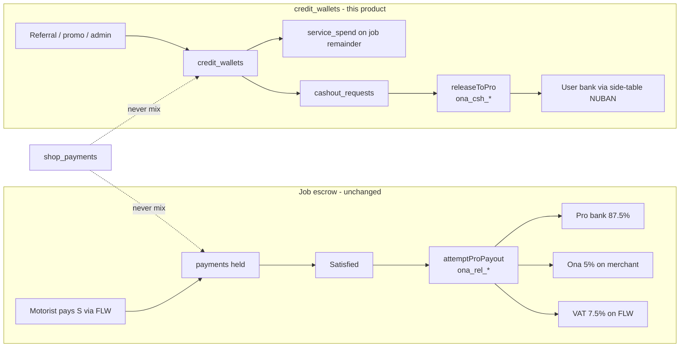
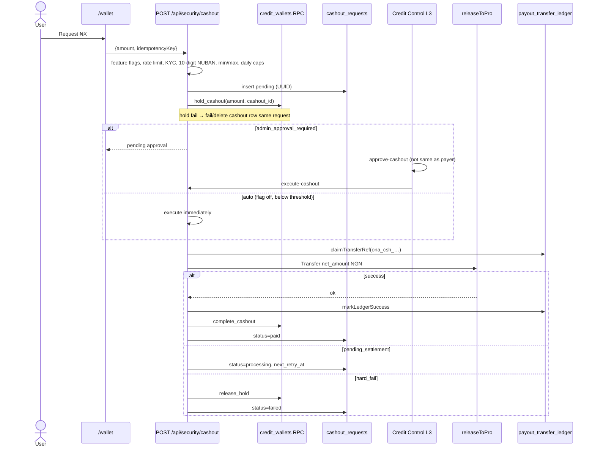
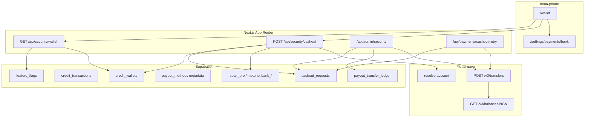

# Ona Full Wallet + Cashout Product

| Field | Value |
|--------|--------|
| **Document** | Ona Full Wallet + Cashout Product |
| **Author** | Ona engineering |
| **Date** | 2026-08-21 |
| **Status** | **v2 DRAFT — not approved. Do not implement.** Collides with as-built v1 (`ona_cash_*` in `cashout-engine.ts`). Express already used migration `076`. Freeze v1 vs v2 before any wallet PR. |
| **Repo** | `/Users/mac/Desktop/Code/Ona` |
| **Audience** | Senior engineers implementing PRs against existing ledger, payout, and admin surfaces |

---

## Overview

Ona already has a credit-wallet schema, phone-shell UI, security APIs, and an admin Credit Control screen — but the product is not a wallet. Job earnings still settle by Flutterwave Transfer from escrow (pro 87.5% / Ona 5% / VAT 7.5%). The tables that *are* wired (`credit_wallets`, `credit_transactions`, `cashout_requests`) implement promotional credits and a **manual** cashout: the user requests, an admin clicks Approve then **Mark Paid**, and no bank transfer runs. Feature flag `feature_flags.wallet` is seeded `false` and is never read. A second unused stub (`wallet_accounts` / `wallet_transactions`) sits beside the live credit ledger.

This design **completes the existing credit ledger** rather than inventing a third one. It turns `credit_wallets` into a production-grade, dual-role NGN wallet for referral / promo / admin credits with a real Flutterwave cashout path, while **leaving job escrow payouts on the current `attemptProPayout` Transfer pipeline**. Wallet cashouts reuse `payout_transfer_ledger` + `releaseToPro` with a distinct transfer-ref prefix so they never collide with job refs (`ona_rel_…`). Shop retail stays on `shop_payments`.

Promo credits are **unfunded Ona liability**. Cashouts and service-spend discounts draw from the **same Flutterwave merchant Available** as job 87.5% — so job retries always win, cashouts observe an Available floor, and there is a global daily cashout cap. NUBAN for `releaseToPro` is resolved from **plaintext side tables** (`repair_pro_profiles` / `motorist_profiles`) until `encryptField` is actually written onto `payout_methods`. Referral `earn` goes to `pending` only; a vest hook on the referred user’s first `paid_booked` is part of the ledger PRs, not a follow-up hope.

The first shippable slice is ledger correctness (holds, reject-release, no double-debit, vest hook) behind the existing flag. Cashout execution, KYC gates, admin dual-control, and phone-shell UX follow as independently reviewable PRs.

---

## Background & Motivation

### Current state (what actually exists)

Two table families were created. Only one is used.

| Family | Migration | Used by | Status |
|--------|-----------|---------|--------|
| `wallet_accounts`, `wallet_transactions` | `supabase/migrations/20260721_026_platform_foundation_rbac.sql` | `identity-sync.ts` (user_id column list only) | Stub. `feature_flags.wallet = false`. Integer **kobo**. No API, no UI. |
| `credit_wallets`, `credit_transactions`, `cashout_requests`, `service_credit_payments` | `supabase/migrations/20260728_036_security_wallet_referral.sql` | `/wallet`, `/api/security/wallet`, `/api/security/cashout`, `/api/admin/security`, admin Credit Control | Live but incomplete. NUMERIC **naira**. Atomic debit RPC in `20260801_045_credit_wallet_atomic_debit.sql`. |

Job money is a third, separate ledger:

- Escrow rows: `payments` via `src/lib/server/payments/escrow-store.ts`
- Transfer uniqueness: `payout_transfer_ledger` (`20260727_034_payout_transfer_ledger.sql`) + `src/lib/server/payments/payout-ledger.ts`
- Settlement: `src/lib/server/payments/payout-settlement.ts` → `releaseToPro()` in `providers.ts`
- Retry: `/api/payments/payout-retry` (Vercel daily + pg_cron every 10 min)
- Split: `splitServiceChargeMinor()` in `src/lib/pricing.ts` — pro 87.5 / Ona 5 / VAT 7.5 of service charge S
- Shop: `shop_payments` via `src/lib/server/shop/payments.ts` — **never** the escrow store

Wallet-adjacent product already in tree:

- Phone UI: `src/app/wallet/page.tsx` (title is still “Refer & Earn”; cashout posts amount only, no bank)
- Menu: both `CLIENT_NAV` and `PRO_NAV` in `src/components/layout/app-menu.tsx` link `/wallet` as “Referral & Earn”
- Pro job money hub: `/settings/payments` (overview / bank / activity) — **this stays the job-earnings surface**
- Admin: `src/app/admin/credit-control/page.tsx` + `/api/admin/security`
- Store: `src/lib/server/security/security-store.ts` (`getOrCreateWallet`, `createCashoutRequest`, `createCreditTransaction`, `updateCashoutStatus`)
- Module stub: `src/lib/server/modules/wallet/README.md` (“Disabled until `feature_flags.wallet = true`”)
- Canonical bank **metadata**: `payout_methods` (one row per `profiles.id`, dual-role) in `20260731_042_identity_sync.sql` — stores `account_number_last4` + `verified: false`. Column `account_number_encrypted` exists; **`encryptField()` is never called anywhere in `src/`**. `identity-sync.ts` upserts last4 only.
- Pro payout bank (live path): plaintext `repair_pro_profiles.bank_code / bank_account_number / bank_account_name` loaded by `loadProBank()` in `payout-settlement.ts`. Motorist refunds use `motorist_profiles.bank_*`. **This is still the NUBAN source of truth for transfers.**
- Bank uniqueness: `/api/payments/check-bank-unique` matches **full 10-digit NUBAN** on side tables and **last4 + bank_code** on `payout_methods` (collision-prone; do not rely on last4 alone for cashout).
- Idempotency helper: `runIdempotent` in `src/lib/server/idempotency.ts` (there is no `withIdempotentOp`).
- Transfer claim: `claimTransferRef` requires `paymentId: string` and `requestId: string` and inserts both; `payment_id` FKs to `payments(id)`.
- Settings: `system_settings.credit_cashout_minimum = 2000`, `credit_cashout_fee_percent = 5`, `admin_approval_required_for_cashout = true`
- Latest migration in tree: `supabase/migrations/20260820_075_automedics_shop.sql` (not 067). Wallet migrations start at `20260821_076_…`.
- Flutterwave NGN transfer minimum: `FLW_NGN_TRANSFER_MIN_MAJOR = 100` in `providers.ts` — **not exported**. Duplicate the constant in `src/lib/server/modules/wallet/settings.ts`.

### Pain points

1. **Flag off, UI on.** `/wallet` is reachable and the APIs do not call `isFeatureEnabled("wallet")`.
2. **Cashout does not move money.** `updateCashoutStatus(..., "paid")` only writes status (and, in the in-memory path, tries a second debit).
3. **Ledger bugs will lose or double-spend credits** (detailed under Proposed Design → Defects to fix).
4. **Bank is optional on the request.** UI never sends `destinationAccount`; Flutterwave cannot pay.
5. **Admin “Mark Paid” is a trust-me button** with no `requireSensitiveAction`, no L3 permission, no transfer.
6. **Job payouts are a mature, anti-regression-protected machine.** Routing 87.5% through this wallet would re-open double-pay, VAT, and Available-balance races already solved in `PAYOUT_SYNC_RELEASE.md`.
7. **Wallet APIs are already live** despite `feature_flags.wallet = false`. Credit Control `approve-referral` / `pay-cashout` are L1-reachable via `requireAdmin()` (`canAccessAdminPath` does not denylist `/admin/credit-control`). Treat existing `credit_wallets` rows as **possibly non-empty** at cutover.
8. **`payout_methods` cannot fund a transfer today.** No encrypted NUBAN is written; job payouts never read that table.

---

## Goals & Non-Goals

### Goals

1. Make `credit_wallets` the single Ona-credit ledger (motorist and repair pro, one row per `profiles.id`).
2. Define credit sources, buckets (pending / available / cashable / blocked), and every debit path with SQL `FOR UPDATE` RPCs.
3. Ship an end-to-end cashout: resolved 10-digit NUBAN → KYC gates → hold → (admin approve if required) → Flutterwave Transfer → ledger success → notify.
4. Keep job escrow release on today’s Transfer path. Do not credit 87.5% into the wallet. **Job Available always beats promo cashouts.**
5. Vest referral credits on the referred user’s first `paid_booked` in the same release train as pending-only `earn`.
6. Phone-shell surfaces: wallet home, cashout, history. Admin: Credit Control executes transfers instead of marking paid (L1 cannot see or act).
7. Security: no self-payment, full-NUBAN uniqueness, rate limits, audit, RLS + service-role (existing 065 pattern).
8. Rollout behind `feature_flags.wallet` (+ `wallet_cashout` sub-flag). Nigeria NGN only. Mock provider locally.

### Non-goals (explicit boundaries)

Do **not** expand this workstream to:

- Shop courier / delivery-provider assignment
- Shop stock for trades other than Automedics
- Notification retry queue (push/SMS)
- Message report / moderation
- Analytics rollups
- Stored-value top-up from a bank (CBN e-money / PSP scope). Wallet is **Ona credits**, not a deposit account
- Card checkout (`feature_flags.cards` remains off)
- Multi-currency / `feature_flags.multi_country`
- Mixing `payments` (job escrow) with `shop_payments`
- Changing `PRO_NET_PAYOUT_PERCENT` / VAT / Flutterwave split-on-collection
- Dropping `wallet_accounts` in v1 (leave frozen; do not write)
- A separate Flutterwave subaccount / second merchant for promo cashouts (v1 stays on the main NGN Available with a floor + priority rules)

---

## Proposed Design

### 1. Ledger choice — complete `credit_*`, freeze `wallet_*`

**Canonical ledger:** `credit_wallets` + `credit_transactions` + `cashout_requests`.

**Rationale**

- Already wired to UI, APIs, admin, referral rewards, and `credit_wallet_debit`.
- Bucket model (cashable vs service-spend vs blocked) matches the product.
- `wallet_accounts` is kobo-integer with no types, no cashout, no callers.

**Frozen:** `wallet_accounts` / `wallet_transactions`. Identity-sync may keep them on the user-id sweep list; no balance writes. A later cleanup migration can `COMMENT` both as `deprecated, unused`.

**Units:** keep **NGN major** `NUMERIC(12,2)` on credit tables (already in prod). Convert to kobo **only** at the Flutterwave / `payout_transfer_ledger` boundary via `toMinorUnits()` from `src/lib/pricing.ts`. Do not store kobo on `credit_wallets` in v1 (avoids rewriting the existing numeric columns). Cutover treats wallets as **possibly live** — see Data Model Changes.

**Invariant:** `available + blocked` is the spendable-or-held total. `cashable ≤ available + blocked-held-for-cashout`. `pending` is unvested and **not** spendable or cashable.

### 2. Who has a wallet

| Actor | Wallet? | Cash out? | Notes |
|--------|---------|-----------|--------|
| Motorist | Yes, lazy-created | Yes, if cashable ≥ min and KYC/bank gates pass | One row keyed by `profiles.id` |
| Repair pro | Yes, same row | Yes, same gates | Dual-role users share **one** wallet |
| Dual-role | One wallet | One destination NUBAN | Transfer NUBAN from side tables until encrypt is written (`payout_methods` is metadata only — Decision 14). Role switch must not fork balances |
| Admin / staff | No product wallet | No | Adjust others via Credit Control |

`getOrCreateWallet(userId)` stays the constructor. Call it from wallet GET, referral credit, admin adjust, and cashout — never from job `attemptProPayout`.

Job **earnings** remain visible on `/settings/payments` (pro) and `/settings/payments` refunds (motorist) via `/api/payments/history`. The wallet page must not pretend job 87.5% is a wallet balance.

### 3. Decision: job earnings stay on Flutterwave Transfer (hybrid C = A for jobs + wallet for credits)

| Option | Meaning | Verdict |
|--------|---------|---------|
| **A** | Straight Flutterwave split/transfer as today (`attemptProPayout` → `releaseToPro`) | **Keep for job escrow** |
| **B** | Credit Ona wallet, user cashes out later | Reject for job earnings |
| **C** | Hybrid | **Adopt:** A for jobs; wallet for referral/promo/admin credits (and later service-spend discounts) |

**Why not B for job earnings**

1. `docs/PAYOUT_SYNC_RELEASE.md` and `docs/ANTI_REGRESSION.md` treat escrow release as a hard machine: one stable `ona_rel_…` ref, `UNIQUE(transfer_ref)`, FLW lookup-before-create, 10 min / 24 h retry, cancel-vs-retry races. Routing 87.5% through `credit_wallets` would duplicate that machine with weaker guarantees.
2. VAT 7.5% is **held on Flutterwave**, not transferred. A wallet credit of “pro net” would hide VAT and make Available-balance accounting lie.
3. Pros are paid on “I’m Satisfied”, not after a ₦2,000 min + 5% fee + admin queue. Delaying job money is a marketplace regression.
4. Mixing job escrow `payments` into `credit_wallets` is the same class of bug as mixing shop into escrow — forbidden by project rules.
5. Nigeria stored-value / e-money optics: promotional credits + limited cashout is a rewards program; holding customer job funds in an Ona wallet looks like operating a PSP.

**What the wallet *does* hold**

One implementable table — source, cashable flag, vest now. No “pending until vest?” ambiguity.

| Source | RPC | `cashable` | Vest | Resulting buckets |
|--------|-----|------------|------|-------------------|
| Referral reward (admin-approved) | `credit_wallet_earn(..., cashable=true, vest_now=false)` | on vest | Referred user’s first `paid_booked` | `pending += amount`. Later vest: `pending -=`, `available +=`, `cashable +=` |
| Promo / campaign (admin) | `credit_wallet_earn(..., cashable=false, vest_now=true)` | no (`spend_only`) | Immediate | `available += amount` only. **Not** pending. **Not** cashable |
| Admin adjustment credit | `credit_wallet_adjust(+amount)` | yes unless body `spend_only: true` | Immediate | `available +=`; `cashable +=` unless spend-only |
| Admin adjustment debit | `credit_wallet_adjust(-amount)` | — | Immediate | From `available` then `cashable`; refuse below 0 |
| Job 87.5% | — | — | — | **Never** |
| Shop payments | — | — | — | **Never** |

`credit_wallet_hold_cashout` requires `status = 'active'` **and** `cashable >= amount` **and** `available >= amount`, so spend-only promo cannot be withdrawn.

Referral `approve-referral` in `/api/admin/security` today calls `createCreditTransaction({ type: "earn" })` (pending **and** available **and** cashable — D7). After PR 1 it must call `credit_wallet_earn(..., vest_now=false)` only. Vest is **PR 1b**. Do not ship pending-only earn to production without 1b.

**Vest call sites (both required — `markJobPaidFromReference` short-circuits):**

`markJobPaidFromReference` (`job-store.ts` ~4291) returns `{ alreadyBooked: true }` **without** `applyEvent` when the job is already `paid_booked` or later. `/api/payments/verify` calls that helper again on already-held escrow (`verify/route.ts` ~67–73). If vest ran only after `applyEvent` and the first book succeeded then vest failed, retry never vests.

Idempotent `credit_wallet_vest` (unique tx on referral_event id) **only helps if it is invoked on both paths:**

1. `applyEvent({ type: "PAYMENT_SUCCESS" })` when `next === "paid_booked"` — vest for `job.motoristId`.
2. `markJobPaidFromReference` when `alreadyBooked === true` — same helper, no-op if already vested.

Helper: `maybeVestReferralForMotorist(motoristId)` in `src/lib/server/modules/wallet/vest.ts` — look up `referral_events` where `referred_user_id = motoristId` and `status = 'approved'`, then `credit_wallet_vest`.

**Unvest call sites (four writers; three skip `applyEvent`):**

`applyEvent` `next === "refunded"` → `refundJobEscrow` (`job-store.ts` ~3310). These **update escrow without `applyEvent`:** `src/app/api/payments/refund/route.ts`, `src/app/api/admin/payments/route.ts` (`cancel_escrow`), `src/lib/server/modules/care-service.ts` (`refund_escrow`). Hooking only `job-store.ts` misses admin/customer/care refunds of the first paid job.

Single helper `maybeUnvestReferralForMotorist(motoristId, requestId)` used by **all four**. Unvest only if `cashable` still covers the original reward; else freeze wallet + `fraud_flags.credit_abuse`. Tests: book then vest-fail then verify retry still vests; admin payments refund unvests.

### 3b. Funding model — same Available, jobs win

Referral / promo / admin credits were **never collected on Flutterwave**. `executeCashoutTransfer` still pays `net` from merchant **Available** via `releaseToPro` — the same pool `attemptProPayout` uses for pro 87.5%. The cashout fee staying “on the merchant” is residual bookkeeping, not reserved float. A few ₦200,000 requests (per-user daily cap ₦500,000) can starve `isSettlementInsufficientError` job payouts. Service-spend “Ona funds the gap” (`creditApplied × 0.875` still paid to the pro) is the same drain. Sibling crons do **not** isolate balances. A second FLW subaccount is a **non-goal** for v1.

**Decision:** cashouts are a **marketing expense** drawn from working capital on the main NGN Available. Promo liability is **not** pre-funded.

| Rule | Spec |
|------|------|
| **Who runs job retries** | Job pg_cron (`/api/payments/payout-retry` → `processDuePayoutRetries`) is the **only** job retry runner. Cashout execute / cashout-retry / Pay now **must not** call `processDuePayoutRetries` (that path is `maxDuration = 60` and can walk 25 FLW transfers). Do **not** skip all cashouts merely because some job is `pending_settlement`. |
| **In-flight job lock** | Before `releaseToPro`, refuse (cashout stays `processing` / `pending_settlement`) if **any** job escrow has `meta.payoutInFlight === true` **and** `now − Date.parse(meta.payoutClaimAt) ≤ 90_000`. Query: `listEscrowsByStatuses(["pending_settlement","release_pending","held"])` and test those two meta fields. This is the 90s claim lock `attemptProPayout` already writes. |
| **Due job reserve** | Export `listPendingSettlementDue` from `payout-settlement.ts` (today it is module-private). Cashout does **not** use `limit=25`. Add `sumDueJobPayoutMajor()`: same filter as `listPendingSettlementDue` (statuses `pending_settlement` \| `release_pending`; exclude success / suspended / cancelled / exhausted; `nextRetryAt` missing or `<= now`), scan cap 500, sum `(proPayoutMinor \|\| split95_5(amountMinor).proPayoutMinor) / 100`. |
| **Available floor** | Require `Available − dueJobPayoutMajor ≥ credit_cashout_available_floor` (default **₦500,000**). If not, treat as cashout `pending_settlement` (retry later), not a hard fail. In-flight jobs are **not** added on top of `dueJobPayoutMajor` — the 90s lock already blocks the transfer. |
| **Global daily cap** | Sum of cashout `net_amount` in statuses `processing\|paid` across **all users** per UTC day ≤ `credit_cashout_global_daily_maximum` (default **₦2,000,000**). Per-user cap stays ₦500,000. |
| **Retry order** | pg_cron: `ona-payout-retry` stays `*/10`. `ona-cashout-retry` is a sibling. Cashout-retry runs the **same in-flight + floor check**, then transfers. It does not await the job batch. |
| **Service-spend P&L** | Customer is charged `S − creditApplied`. Pro still receives `0.875 × S`. Extra out of Available = `creditApplied × 0.875` (plus FLW fees on the smaller collection). Floor check at job **release** is the existing job retry, not a cashout concern. Do not apply credits if `creditApplied × 0.875` would push `Available − dueJobPayoutMajor` below the floor. |
| **Ops** | Dashboard shows Available, `dueJobPayoutMajor`, floor, remaining global cashout cap. Alert if Available &lt; floor. |

| Debit | `transaction_type` | Effect |
|--------|--------------------|--------|
| Cashout request | `block` | available −X, blocked +X, cashable −X; `cashout_requests` row `pending` |
| Cashout paid | `cashout` | blocked −X; redeemed +X; **do not debit available again** |
| Cashout rejected / failed / expired | `hold_release` | blocked −X, available +X, cashable +X (`credit_wallet_release_hold`; no-op keys on existing `hold_release` tx) |
| Service spend (Phase 1.5) | `service_spend` | available −X; never from blocked; never from pending |
| Fraud freeze | `block` with `reference_type=fraud` | Wallet `status` frozen (new column) |



### 4. Defects in the current credit path (must fix before turning the flag on)

These are in `src/lib/server/security/security-store.ts` and `credit_wallet_debit` today:

| # | Defect | Impact | Fix |
|---|--------|--------|-----|
| D1 | `createCashoutRequest` holds via `block`, then `updateCashoutStatus("paid")` calls `createCreditTransaction({ type: "cashout" })` which **debits `available` again** | Double-spend on every successful cashout (in-memory path). DB path on paid does **not** debit at all — balances stuck in `blocked` | `credit_wallet_complete_cashout` RPC: blocked −X, redeemed +X only |
| D2 | Reject / fail / reverse does **not** release `blocked_credits` | User funds frozen forever | `credit_wallet_release_hold` RPC |
| D3 | Cashout INSERT lets Postgres generate UUID; hold RPC uses in-memory `csh-mem-…` as `p_reference_id` | Hold and request cannot be reconciled | Insert cashout first (`returning id`), pass that UUID into the hold RPC |
| D4 | Cashout gate uses `availableCredits`, not `cashableCredits` | Spend-only promo can be withdrawn as cash | Gate on `cashable_credits` |
| D5 | `if (wallet.blockedCredits > 0) refuse` | Any hold (cashout or fraud) blocks a second cashout implicitly; also blocks if a stale hold exists | Partial unique index: one **open** cashout per user; fraud uses `credit_wallets.status` |
| D6 | `createCreditTransaction` requires `amount > 0`; admin UI offers `+/-` | Debit adjust always 400s | Signed adjust RPC |
| D7 | `earn` adds to `pending` **and** `available` **and** `cashable` in one step | Pending is meaningless | Earn → pending; `credit_wallet_vest` moves pending → available+cashable |
| D8 | Feature flag never checked | Wallet is live in prod UI while flagged off | Gate APIs + page |
| D9 | In-memory Maps mixed with DB | Split-brain across Vercel isolates | DB-only when `isSupabaseAdminConfigured()`; memory only in unit tests |
| D10 | `credit_wallet_debit` swallows INSERT errors (`EXCEPTION WHEN OTHERS THEN NULL`) | Silent missing audit rows | Fail the RPC if the tx insert fails |
| D11 | Admin `pay-cashout` is status-only | Money never leaves Flutterwave | Call `executeCashoutTransfer` |
| D12 | No idempotency key on POST `/api/security/cashout` | Double-submit = two holds | `runIdempotent` (`src/lib/server/idempotency.ts`) + GET-or-create on `(user_id, idempotency_key)` |
| D13 | `getOrCreateWallet` uses `memId("wal")` then `insert({ user_id })` without `returning`; `persistWallet` updates `.eq("id", wal-mem-*)` | Updates never hit the DB UUID; `listCreditTransactions` can show duplicate mem+DB rows | Always `returning *`; never persist `wal-mem-*` when Supabase is configured |
| D14 | Doc previously claimed `encryptField` already wires `payout_methods.account_number_encrypted` | Column exists; **zero writes** | Resolve plaintext NUBAN from side tables; backfill + write encrypt on bank save (PR 3) |

### 5. Data model (delta on existing tables)

Keep existing columns. Add only what cashout execution and vesting need. Head of tree is `20260820_075_automedics_shop.sql`. **One migration map:**

| File | PR | Contents |
|------|----|----------|
| `supabase/migrations/20260821_076_wallet_ledger_rpc.sql` | 1 | `credit_wallets.status` / `currency`; earn/vest/unvest/hold/complete/release/adjust RPCs; unique tx index |
| `supabase/migrations/20260821_077_wallet_cashout_columns.sql` | 3 | `cashout_requests` execute columns + one-open / idempotency indexes; `payout_transfer_ledger.source_type` / `source_id` |
| `supabase/migrations/20260821_078_cashout_retry_pgcron.sql` | 4 | `install_cashout_retry_cron()` + `cashout_retry_secret` |

```sql
-- credit_wallets
ALTER TABLE public.credit_wallets
  ADD COLUMN IF NOT EXISTS currency text NOT NULL DEFAULT 'NGN',
  ADD COLUMN IF NOT EXISTS status text NOT NULL DEFAULT 'active'
    CHECK (status IN ('active', 'frozen', 'closed')),
  ADD COLUMN IF NOT EXISTS last_cashout_at timestamptz;

-- cashout_requests
ALTER TABLE public.cashout_requests
  ADD COLUMN IF NOT EXISTS transfer_ref text,
  ADD COLUMN IF NOT EXISTS payout_ledger_id uuid,
  ADD COLUMN IF NOT EXISTS destination_bank_code text,
  ADD COLUMN IF NOT EXISTS destination_account_last4 text,
  ADD COLUMN IF NOT EXISTS destination_account_name text,
  ADD COLUMN IF NOT EXISTS approved_by uuid REFERENCES public.profiles(id),
  ADD COLUMN IF NOT EXISTS paid_by uuid REFERENCES public.profiles(id),
  ADD COLUMN IF NOT EXISTS idempotency_key text,
  ADD COLUMN IF NOT EXISTS next_retry_at timestamptz,
  ADD COLUMN IF NOT EXISTS retry_count integer NOT NULL DEFAULT 0,
  ADD COLUMN IF NOT EXISTS kyc_snapshot jsonb NOT NULL DEFAULT '{}'::jsonb;

CREATE UNIQUE INDEX IF NOT EXISTS cashout_requests_idempotency_uidx
  ON public.cashout_requests (user_id, idempotency_key)
  WHERE idempotency_key IS NOT NULL;

-- At most one in-flight cashout per user
CREATE UNIQUE INDEX IF NOT EXISTS cashout_requests_one_open_uidx
  ON public.cashout_requests (user_id)
  WHERE status IN ('pending', 'approved', 'processing');

-- credit_transactions: extend allowed types
-- vest | hold_release already covered by reverse; add 'vest' explicitly
ALTER TABLE public.credit_transactions
  DROP CONSTRAINT IF EXISTS credit_transactions_transaction_type_check;
ALTER TABLE public.credit_transactions
  ADD CONSTRAINT credit_transactions_transaction_type_check
  CHECK (transaction_type IN (
    'earn','vest','redeem','cashout','reverse','block','adjust','service_spend','hold_release'
  ));

CREATE UNIQUE INDEX IF NOT EXISTS credit_tx_reference_uidx
  ON public.credit_transactions (transaction_type, reference_type, reference_id)
  WHERE reference_id IS NOT NULL
    AND length(reference_id) > 0
    AND status IN ('completed', 'pending', 'approved');
```

Empty-string `reference_id` (today’s mapper uses `String(… ?? "")`) must **not** participate in the unique index. Backfill empty strings to NULL before creating the index.

`payout_transfer_ledger.payment_id` FKs to `payments(id)`. `claimTransferRef` today **requires** `paymentId: string` and `requestId: string` and inserts both. Cashouts have no payment row — passing `""` fails UUID/FK. The table default on a new `source_type` is **not** enough.

```sql
ALTER TABLE public.payout_transfer_ledger
  ADD COLUMN IF NOT EXISTS source_type text NOT NULL DEFAULT 'job_escrow'
    CHECK (source_type IN ('job_escrow', 'wallet_cashout')),
  ADD COLUMN IF NOT EXISTS source_id uuid;

CREATE INDEX IF NOT EXISTS payout_transfer_ledger_source_idx
  ON public.payout_transfer_ledger (source_type, source_id);
```

**`claimTransferRef` must change** (PR 4 — job callers stay byte-compatible):

```ts
export async function claimTransferRef(input: {
  transferRef: string;
  paymentId?: string | null;   // required for job_escrow; null for wallet_cashout
  requestId?: string | null;   // required for job_escrow; null for wallet_cashout
  amountMinor: number;
  currency?: string;
  accountBank?: string;
  accountNumber?: string;
  beneficiaryName?: string;
  sourceType?: "job_escrow" | "wallet_cashout"; // default job_escrow
  sourceId?: string | null;
}): Promise<…>
```

Insert: `payment_id: input.paymentId ?? null`, `request_id: input.requestId ?? null`, `source_type: input.sourceType ?? "job_escrow"`, `source_id: input.sourceId ?? null`. Existing `attemptProPayout` keeps passing `paymentId` + `requestId` (and may omit `sourceType`). Cashouts pass `sourceType: "wallet_cashout"`, `sourceId: cashout.id`, **omit** payment/request ids.

`recentDuplicatePayout`: add optional `sourceType`. Apply the extra same-source filter **only** when the caller passes `sourceType === "wallet_cashout"` so two job retries to the same bank+amount in 24h still block. Add a job-path test that `recentDuplicatePayout` without `sourceType` (or with `job_escrow`) still blocks same-bank same-amount job retries.

`service_credit_payments` stays as the job-discount journal (Phase 1.5). Do not reuse it for shop.

New `system_settings` keys (seed in the same migration):

| Key | Default | Meaning |
|-----|---------|---------|
| `credit_cashout_minimum` | `2000` | Already exists |
| `credit_cashout_fee_percent` | `5` | Already exists |
| `admin_approval_required_for_cashout` | `true` | Already exists |
| `credit_cashout_maximum` | `200000` | Per request |
| `credit_cashout_daily_maximum` | `500000` | Sum of net paid+processing per user / UTC day |
| `credit_cashout_global_daily_maximum` | `2000000` | Sum of net paid+processing **all users** / UTC day |
| `credit_cashout_available_floor` | `500000` | Do not start a cashout if Available − in-flight job payouts &lt; floor |
| `credit_cashout_bvn_threshold` | `50000` | BVN required when **requested** ≥ this |
| `credit_referral_reward_amount` | `500` | Align with `referral_reward_amount` |
| `credit_referral_vest_on` | `"first_paid_job"` | Vest rule |
| `credit_service_spend_max_percent` | `20` | Max share of agreed S payable in credits |
| `wallet_cashout_auto_retry_window_hours` | `24` | Mirror job payout |

New feature flags:

| Key | Default | Meaning |
|-----|---------|---------|
| `wallet` | `false` | Master: GET wallet, history, referral credit posting. **Seeded in 026; `isFeatureEnabled` is never called today.** |
| `wallet_cashout` | `false` | POST cashout + admin execute. Requires `wallet`. **Does not exist yet — add in 076 seed.** Cashout-retry does **not** read this flag for `processing` rows. |
| `wallet_service_spend` | `false` | Apply credits at job checkout. **Does not exist yet.** |

`app_settings.payments.walletEnabled` is **not** the source of truth. Keep it in sync when toggling `feature_flags.wallet` from admin, but APIs read `isFeatureEnabled("wallet")` only.

### 6. SQL RPCs (service_role only, `SECURITY DEFINER`, `SET search_path = public`)

Replace the leaky `credit_wallet_debit` with an explicit set. All take `FOR UPDATE` on `credit_wallets`. **No inner `BEGIN … EXCEPTION WHEN OTHERS`** — if the `credit_transactions` insert fails, the whole function must `RAISE` so the wallet update rolls back. `GRANT EXECUTE` to `service_role` only (same as 045).

Frozen/closed wallets (`credit_wallets.status <> 'active'`): refuse `earn` (except admin `adjust`), `hold_cashout`, `vest` (except the refund unvest path), and `service_spend`. Admin `adjust` may still credit/debit a frozen wallet (ops recovery).

```
credit_wallet_earn(user_id, amount, cashable boolean, vest_now boolean,
                   reference_type, reference_id, reason)
  → require status=active, amount > 0
  → total_earned += amount
  → if vest_now AND cashable:
        available += amount; cashable += amount
    else if vest_now AND NOT cashable:          -- promo spend_only
        available += amount                     -- NOT cashable, NOT pending
    else:                                       -- referral
        pending += amount                       -- NOT available yet
  → insert credit_transactions type=earn (status=completed)
  → unique (earn, reference_type, reference_id) prevents double-approve

credit_wallet_vest(user_id, amount, cashable boolean, reference_id)
  → require pending >= amount
  → pending -= amount; available += amount
  → if cashable: cashable += amount
  → insert type=vest, reference_type=referral, reference_id=referral_event.id
  → idempotent: if vest tx already exists for this reference_id, return ok (no-op)

credit_wallet_unvest(user_id, amount, reference_id)
  → if cashable and available still cover amount:
        cashable -= amount; available -= amount; pending += amount
        insert type=reverse
    else: return ok=false 'already_consumed' (caller freezes + fraud flag)

credit_wallet_hold_cashout(user_id, amount, cashout_id)
  → require status=active, cashable >= amount, available >= amount
  → available -= amount; cashable -= amount; blocked += amount
  → insert type=block, reference_type=cashout_hold, reference_id=cashout_id

credit_wallet_complete_cashout(user_id, amount, cashout_id)
  → if a completed type=cashout tx already exists for this cashout_id:
        return ok (no-op)   -- FLW already paid; never abort after success
  → if blocked < amount AND no cashout tx: return error
  → blocked -= amount; redeemed += amount
  → insert type=cashout; NEVER touch available

credit_wallet_release_hold(user_id, amount, cashout_id, reason)
  → if hold already released (no blocked for this id / hold_release tx exists):
        return ok (no-op)
  → blocked -= amount; available += amount; cashable += amount
  → insert type=hold_release

credit_wallet_adjust(user_id, signed_amount, admin_id, reason, spend_only boolean)
  → positive && spend_only: available +=, NOT cashable
  → positive && !spend_only: available +=; cashable +=; total_earned +=
  → negative: from available (and cashable) only; refuse below 0
  → allowed on frozen wallets

credit_wallet_service_spend(user_id, amount, service_request_id)
  → require status=active
  → burn spend-only first: let spendable_promo = available - cashable
        burn = min(amount, spendable_promo) from available only
        rest from available AND cashable
  → available -= amount; service_spend += amount
  → cashable = GREATEST(0, cashable - rest)
```

After PR 3, **drop or wrap** `credit_wallet_debit` so it is not left beside the new RPCs. Preferred: `CREATE OR REPLACE` it as a wrapper that `RAISE`s `'deprecated, use credit_wallet_hold_cashout'`. `createCashoutRequest` in `security-store.ts` must not call it after PR 3.

### 7. Module layout

Move domain logic out of the 1.3k-line security store. Keep security-store as a thin re-export during the first PR so existing imports compile.

```
src/lib/server/modules/wallet/
  README.md                 — update: enabled by feature_flags.wallet
  types.ts                  — re-export CreditWallet / CashoutRequest
  settings.ts               — parse system_settings numbers (JSON string or number)
  store.ts                  — getOrCreateWallet, list txs (DB only)
  ledger.ts                 — RPC wrappers
  cashout.ts                — create / approve / reject / execute
  vest.ts                   — maybeVest / maybeUnvest (PR 1b)
  kyc.ts                    — NIN/BVN/bank gates
  spend.ts                  — service_spend (PR 7)
  __tests__/
    ledger.test.ts
    vest.test.ts
    cashout.test.ts
    kyc.test.ts
```

`src/lib/server/modules/index.ts` **exports `./wallet` in PR 1** (today it does not).

Do **not** put wallet domain in `src/lib/server/payments/` except: `claimTransferRef` signature + `source_type` insert (PR 4), and `executeCashoutTransfer` calling `releaseToPro` / `findExistingFlutterwaveTransfer` / `getFlutterwaveNgnBalances`. No job control-flow edits.

### 8. Cashout flow (end-to-end)

**Destination bank — never a free-text field on the cashout form.**

`encryptField()` (`src/lib/server/modules/crypto-fields.ts`) is **dead code**. `payout_methods.account_number_encrypted` is an empty column. `identity-sync.ts` upserts `account_number_last4` and `verified: false` only. Live job payouts use plaintext `repair_pro_profiles.bank_account_number` via `loadProBank()`. Last4 + `bank_code` uniqueness on `payout_methods` is collision-prone; side tables match the full 10-digit NUBAN (`/api/payments/check-bank-unique`).

**NUBAN used for `releaseToPro({ accountNumber })` — resolution order:**

1. `decryptField(payout_methods.account_number_encrypted)` if the ciphertext is present and decrypts to 10 digits.
2. Else plaintext `repair_pro_profiles.bank_account_number` (same field `loadProBank` uses).
3. Else plaintext `motorist_profiles.bank_account_number`.

If none yield a 10-digit NUBAN → **refuse cashout** (`400 bank_incomplete`). Do not send last4 to Flutterwave.

Until encryption is actually written, **side tables are the source of truth for transfers** (Key Decision 14). `payout_methods` remains the canonical **metadata** row (bank_code, name, last4, linked_role) for dual-role display.

**Backfill + write path (PR 3, same release as cashout execute):**

1. Inventory: count side-table rows with 10-digit NUBAN vs `payout_methods` with empty `account_number_encrypted`.
2. SQL/script: for each `profiles.id`, copy the winning side-table NUBAN through `encryptField` into `payout_methods.account_number_encrypted`, set last4, keep `verified` as-is (false until resolve-account succeeds).
3. Bank-save APIs (`/settings/payments/bank`, artisan profile, identity-sync winner write) **start calling `encryptField`** on that column. Side tables continue to store plaintext so `loadProBank` / job payouts do not change in this PR.
4. Cashout uniqueness: run the **full 10-digit** check against both side tables (existing `check-bank-unique` logic), not last4.

Cashout row stores **last4 + bank_code + account_name** only (never full NUBAN).

**Name verify:** existing `POST /api/payments/resolve-account`. Cashout create re-resolves server-side; mismatch vs stored name → 400 `bank_name_mismatch`.

**Uniqueness / mule:** cashout does not let the user pick a *different* account than the resolved profile bank. To change bank, user goes to `/settings/payments/bank` / `/settings/bank-setup`.



**Fees and limits**

- `fee = round(requested * fee_percent / 100, 2)`
- `net = requested - fee` (user receives net; Ona keeps fee on Flutterwave merchant — **same economic home as the 5% job commission**, not a new wallet)
- `requested ≥ max(minimum, ceil(100 / (1 - fee_percent/100)))` so **net ≥ ₦100** (Flutterwave NGN transfer minimum; `FLW_NGN_TRANSFER_MIN_MAJOR` in `providers.ts` is **not exported** — duplicate in `wallet/settings.ts`)
- `requested ≤ credit_cashout_maximum`
- UTC-day sum of `net_amount` for statuses `processing|paid` ≤ `credit_cashout_daily_maximum` **per user**
- UTC-day sum across **all users** ≤ `credit_cashout_global_daily_maximum`
- Available floor (§3b) before any `releaseToPro`
- One open cashout per user (unique index)
- Currency: NGN only (`credit_wallets.currency` and `FLUTTERWAVE_FORCE_NGN`)
- Duplicate the ₦100 floor in `src/lib/server/modules/wallet/settings.ts` (do not import the unexported `FLW_NGN_TRANSFER_MIN_MAJOR`)

**Idempotency**

There is no `withIdempotentOp`. Use `runIdempotent` from `src/lib/server/idempotency.ts`:

```ts
await runIdempotent({
  opKey: `cashout:execute:${cashoutId}`,
  opType: "cashout_execute",
  actorKind: "admin",
  actorId: actorAdminId ?? "system",
  run: () => executeCashoutTransferOnce(…),
});
```

**Create (POST `/api/security/cashout`):**

- If the client sends `Idempotency-Key`, use it.
- If missing, the **server generates** a UUID (so PR 3 can ship before the wallet page sends a header; PR 6 should still send one).
- Stored on `cashout_requests.idempotency_key`.
- **GET-or-create** on unique `(user_id, idempotency_key)`: if a row exists, return **200** `{ cashout: existing }` (replay), never 409 and never a second hold.

**Insert-then-hold:** `INSERT … RETURNING id`, then `credit_wallet_hold_cashout`. If the hold RPC fails, **in the same request** set that row `status=failed` (or `DELETE` it) so `cashout_requests_one_open_uidx` does not leave a permanent orphan `pending` with no hold.

Transfer ref is **stable forever** per cashout:

```ts
export function stableCashoutTransferReference(cashoutId: string, userId: string): string {
  const base = `ona_csh_${cashoutId.replace(/-/g, "").slice(0, 12)}_${userId.replace(/-/g, "").slice(0, 8)}`;
  return base.slice(0, 50);
}
```

Job refs stay `ona_rel_…` (`stableProTransferReference`). Prefix split is the reconciliation key.

**Cashout status machine (duplicate of job transfer calls, not of escrow meta)**

Job 90s in-flight lock lives on **escrow meta** (`payoutClaimId` / `payoutClaimAt`). Cashouts do not have escrow. The lock is the row itself:

```
pending  --user create (hold RPC ok)--
   |  reject / expire → failed + credit_wallet_release_hold
   v
approved  --L3 approve; no FLW yet--
   |  (auto-execute skips this when admin_approval_required=false)
   v
processing  --claimed--
   |     UPDATE cashout_requests
   |       SET status='processing', transfer_ref=ona_csh_*, next_retry_at=…
   |     WHERE id=$id
   |       AND status IN ('approved','pending')
   |       AND (next_retry_at IS NULL OR next_retry_at <= now())
   |     RETURNING *     -- 0 rows => another worker owns it; exit
   |
   |  then claimTransferRef (optional paymentId/requestId)
   |  then findExistingFlutterwaveTransfer
   |  then job-priority (§3b):
   |       if any escrow meta.payoutInFlight && claimAt within 90s
   |         → pending_settlement (do NOT releaseToPro)
   |       dueJobPayoutMajor = sumDueJobPayoutMajor()
   |       if Available − dueJobPayoutMajor < floor
   |         → pending_settlement
   |  then releaseToPro({
   |         reference: ona_csh_*,          -- MUST equal transferReference
   |         transferReference: ona_csh_*, -- mock returns mock-xfer-${reference}
   |         amountMinor: toMinorUnits(net),
   |         bankCode, accountNumber, accountName
   |       })
   |
   +--> paid     : markLedgerSuccess + credit_wallet_complete_cashout
   |               (complete RPC no-ops if cashout tx already exists)
   +--> processing + next_retry_at  : isSettlementInsufficientError
   |               OR Available < floor
   |               markLedgerFailed (initiated → failed) so retry can
   |               reacquireFailedClaim on the SAME transfer_ref
   +--> failed + release_hold : isHardPayoutFailure
```

Map `releaseToPro` / `humanizeFlutterwaveTransferError` copy for cashout — never tell a credit user “Funds remain in escrow” or “Repair Pro must save bank details.” Cashout strings: “Could not pay out to your bank. Credits have been returned to your wallet.” / “Add a 10-digit bank account in Payments before cashing out.”

**Retry**

- `isSettlementInsufficientError` or floor miss → stay `processing`, `next_retry_at = now+10m`, `retry_count++`. After `wallet_cashout_auto_retry_window_hours` (24h) → `failed` + **release hold** (unlike jobs, which suspend escrow; credits must return to cashable).
- Hard fail → immediate `failed` + release hold.
- Retry path: `reacquireFailedClaim(ona_csh_*)` after `markLedgerFailed` (which only flips `status=initiated`). Do not invent a new ref.

**Cron (sibling — does not run job retries)**

- New route `/api/payments/cashout-retry` — same `CRON_SECRET` / `ONA_CRON_SECRET` / `x-cron-secret` pattern as `payout-retry/route.ts`.
- **Does not check `feature_flags.wallet_cashout`** for rows already `processing`. The flag only blocks **new** POSTs. Rollback must not freeze in-flight money.
- Handler runs the §3b in-flight + `sumDueJobPayoutMajor` floor check, then `executeCashoutTransfer`. **Does not** call `processDuePayoutRetries`. Job pg_cron remains the only job retry runner.
- Migration **`20260821_078_cashout_retry_pgcron.sql`**: `install_cashout_retry_cron()` mirroring `install_payout_retry_cron()` in `20260814_067_payout_retry_pgcron.sql`. Seed `ona_cron_config` name `cashout_retry_secret` via `set_cron_secret`. Jobname `ona-cashout-retry`, `*/10 * * * *`, POST `https://336699.vercel.app/api/payments/cashout-retry`.
- `vercel.json`: daily safety-net cron like payout-retry (`0 8 * * *`).

**Reconciliation**

- `findExistingFlutterwaveTransfer(ona_csh_…)` before create.
- `hasSuccessfulPayout({ transferRef })` already works without `paymentId`. Cashouts always pass `transferRef`. Optional `sourceType`/`sourceId` later; do not require them for the job path.
- `recentDuplicatePayout`: extra `source_type` filter **only** when the cashout caller passes `sourceType: "wallet_cashout"`. Job callers unchanged; add a test that job same-bank same-amount within 24h still blocks.

### 9. KYC / NIN / BVN gates

Existing identity:

- Motorist: `motorist_profiles.nin_last4`, `nin_verified`, `bvn_last4`, `bvn_verified` (`20260714_005_motorist_identity.sql`)
- Pro: same columns on `repair_pro_profiles`
- Verify APIs: `/api/verify/nin`, `/api/verify/bvn` (Prembly, format-only in dev)
- Self-pay: `isSamePerson()` in `self-payment-guard.ts` (name + NIN last4 + BVN last4)

Cashout create (`src/lib/server/modules/wallet/kyc.ts`):

1. `profiles.is_phone_verified` (036 column) **or** existing OTP-verified phone on auth user.
2. **NIN verified** on motorist **or** pro side table (dual-role: either is enough; identity-sync should already mirror).
3. **Bank resolved:** 10-digit NUBAN from side tables (Decision 14) + live `resolve-account` name match. `payout_methods.verified` is display metadata only until encrypt backfill.
4. If `requested ≥ credit_cashout_bvn_threshold` (default ₦50,000): **BVN verified**.
5. `credit_wallets.status === 'active'` and no open `fraud_flags` of type `cashout_risk` / `credit_abuse` with `status in ('open','reviewing')`.
6. Snapshot the gate results into `cashout_requests.kyc_snapshot` (last4 only, never full NIN/BVN).

Self-payment: cashout is user → own bank, which is intended. The existing `isSamePerson` guard stays on **job escrow init** (`/api/payments/init`). Additionally, refuse cashout if the destination NUBAN belongs to a **different** `profiles.id` (bank uniqueness). Referral already blocks self-referral (`createReferralEvent`).

### 10. Dual-control admin

Today `/api/admin/security` uses `requireAdmin()` with **no** `CarePermission` and **no** `requireSensitiveAction`. `/admin/credit-control` is in `src/components/admin/admin-shell.tsx` Operations nav. `canAccessAdminPath` / `canAccessAdminPathUi` (`admin-roles.ts`, `admin-role-ui.ts`) **do not denylist it** — L1 can Mark Paid today.

New permissions on `CarePermission` in `src/lib/server/modules/admin-roles.ts`:

| Permission | L1 | L2 | L3 | L4 | L5 |
|------------|----|----|----|----|----|
| `view_wallet` | — | yes | yes | yes | yes |
| `wallet_adjust` | — | — | yes | yes | yes |
| `wallet_cashout_approve` | — | — | yes | yes | yes |
| `wallet_cashout_pay` | — | — | yes | yes | yes |

Rules:

- **Path ACL:** `canAccessAdminPath` + `canAccessAdminPathUi` + `admin-shell.tsx`: `/admin/credit-control` is **L2+** (view). L1 must not see the nav item. API GET `section=cashouts|credits` requires `view_wallet`.
- Approve / reject: `wallet_cashout_approve`. Execute: `wallet_cashout_pay`.
- Add **both** `wallet_cashout_approve` and `wallet_cashout_pay` to `PASSWORD_GATED`.
- Add **`wallet_cashout_pay` to `alwaysUnlock`** in `requireSensitiveAction` beside `escrow_release` / `escrow_refund` so **every** level including L5 must enter the staff access code to pay. Approve is gated for L1–L4; L5 may skip unlock on approve only (not on pay).
- **Four-eyes:** `paid_by` must be ≠ `approved_by` when `admin_approval_required_for_cashout` is true. Same admin → 403 `dual_control_required`.
- **L5 break-glass:** `POST { action: "execute-cashout", id, force: true, reason }` with `reason.length >= 8`. Allowed only for `super_admin`. Writes `admin_actions` `action_type=dual_control_break_glass`. `executeCashoutTransfer({ force: true })` skips the four-eyes check only.
- **Columns:** `approved_by` set on approve; `paid_by` set on execute (the actor who pressed Pay now). Keep `admin_id` as **last actor** (update on every action). Do not dual-write conflicting meanings into `admin_id`.
- **Mark Paid:** **removed for L3.** L5 may run a **manual complete** only after execute has `hard_fail` (FLW will not pay). **Never INSERT a second `payout_transfer_ledger` row for the same `ona_csh_*`** (`payout_transfer_ledger_transfer_ref_uidx` is UNIQUE). After hard-fail, `claimTransferRef` already inserted the row and `markLedgerFailed` flipped it to `failed`.

```ts
// Record manual payout — same transfer_ref forever
const { data: updated } = await sb.from("payout_transfer_ledger")
  .update({
    status: "success",
    meta: { …existing, manual: true, manualAt: nowIso(), manualBy: actorAdminId },
    updated_at: nowIso(),
  })
  .eq("transfer_ref", ona_csh_ref)
  .neq("status", "success")
  .select("id")
  .maybeSingle();
if (!updated) {
  const existing = await sb.from("payout_transfer_ledger")
    .select("id, status").eq("transfer_ref", ona_csh_ref).maybeSingle();
  if (existing.data?.status === "success") { /* already paid — complete_cashout no-op */ }
  else if (!existing.data) {
    // execute never claimed — insert once
    await claimTransferRef({ transferRef: ona_csh_ref, sourceType: "wallet_cashout",
      sourceId: cashoutId, amountMinor, /* paymentId/requestId omitted */ });
    await markLedgerSuccess(ona_csh_ref, null);
    // then patch meta.manual = true
  } else {
    throw new Error("Could not mark ledger success");
  }
}
await credit_wallet_complete_cashout(…);
```

Not a status-only write. Not shown as “Mark Paid” — label **Record manual payout**. Tests: hard-fail then L5 manual → **one** ledger row, `status=success`, `meta.manual=true`.
- Adjust: `wallet_adjust` + unlock + reason ≥ 8 chars. Pass the **signed** amount through to `credit_wallet_adjust` — **never `Math.abs`**. Negative is a debit.
- Audit: `logAdminAction` + `admin_actions` + `writeAuditLog` for pay/adjust.

Admin UI (`src/app/admin/credit-control/page.tsx`): show bank last4, name, transfer_ref, retry, KYC snapshot, dual-control warning. Do not show full NUBAN (`view_bank_full` remains L3+; cashout table shows last4).

### 11. Service spend (Phase 1.5 — designed, flagged off)

`service_credit_payments` exists and is unused. Turning it on without rules would under-collect escrow and starve pro 87.5%.

**Rule:** credits are an **Ona discount**, not a second tender. PR 7 stays last; the init/verify contract must be specified now so it is not implemented as “charge remainder but verify S.”

- Agreed service charge remains S (`snap.agreedAmountMinor`).
- `initCharge` **amount** = remainder = `S − creditApplied` (kobo).
- `createEscrowPayment.amountMinor` stays **S** so `split95_5` / `attemptProPayout` still split full labour. Escrow **meta**: `{ agreedSMajor, creditAppliedMajor, chargedMinor, walletSpendId }`.
- **Verify / webhook** asserts provider amount = **`chargedMinor` (remainder)**, **not** S. Today init/verify compare provider amount to escrow `amountMinor` — that path **must** read `meta.chargedMinor` when present. Tests: verify succeeds when FLW amount = remainder; fails when FLW amount = S if credits were applied; `split95_5` still on S; remainder ≥ ₦120.
- Pro payout remains `87.5% of S` from merchant Available. Extra out of Available = `creditApplied × 0.875` (§3b). Apply floor at release.
- `creditApplied ≤ min(available_credits, S * credit_service_spend_max_percent / 100, S − 120)`.
- **Burn order:** spend-only promo first (`available − cashable`), then cashable. Matches `credit_wallet_service_spend`.
- Never 100% credit payment in v1. Never shop.
- Journal: `service_credit_payments` + RPC, `reference_id = service_requests.id`.
- Hook: `/api/payments/init` after `isSamePerson`, before `initCharge`.

Ship behind `wallet_service_spend`. Default false until cashout has soaked.

### 12. Phone-shell UI

Keep `#ona-phone`. PR 6 must set the wallet root to `flex h-full min-h-0 flex-col overflow-hidden` (`docs/ANTI_REGRESSION.md` §1) — today `src/app/wallet/page.tsx` is `flex h-full flex-col` without `min-h-0`. `PageHeader` + `navigateBack`.

`/wallet` is a shared path (`isSharedAppPath` already includes it). **The route always returns HTTP 200.** If `feature_flags.wallet` is off, render the in-shell “coming soon” empty state (do not 404). APIs return 403 `wallet_disabled`.

**Rename in product copy, not the route.** Page title becomes **Wallet**. `nav.wallet` is `"Wallet"` in `en.ts` only; other catalogs still say “Referral & Earn” for `nav.wallet`. PR 6: add strings in `en.ts` first, then every catalog (`ha`, `pcm`, `pt`, `yo`, `fr`, `zh`, `sw`, `es`, `ar`, `ig`). Point `CLIENT_NAV` / `PRO_NAV` `labelKey` at `nav.wallet` once cashout ships; until then menu can stay `nav.referralEarn` if flag off.

Cashout min on the page today is hardcoded `formatMoney(2000)` — PR 6 **must** read `limits.min` from GET wallet. No hardcoded 2000.

Surfaces (single page with stacked cards, no nested router required for v1):

1. **Balance card** — Available, Cashable, Pending, Blocked. Hide empty blocked. Do not show job 87.5%.
2. **Cash out** — amount, live fee/net, min/max, disabled reasons (KYC, no bank → CTA `/settings/payments/bank`, frozen, pending cashout). Submit uses `authFetch` + idempotency key.
3. **Open cashout** — status chip (`pending` / `approved` / `processing` / `paid` / `failed`) + last4.
4. **Refer & Earn** — keep existing referral card.
5. **History** — credit txs + cashouts, 20 rows, “see all” can stay on-page scroll (phone shell).

Do **not** add a second wallet entry under Payments hub. Cross-link: Payments hub row “Ona credits” → `/wallet` when flag on. Job activity stays on `/settings/payments/activity`.

Mock provider: when `resolveProvider() === "mock"` (local, never production — `isProductionRuntime()` already forces flutterwave), `executeCashoutTransfer` marks paid without HTTP, same as `releaseToPro` mock.

### 13. Architecture diagram (runtime)



---

## API / Interface Changes

All responses stay `{ ok, data }` / `{ ok: false, error }` via `apiOk` / `apiFail`.

### User APIs

**`GET /api/security/wallet`** — keep. Flag gate: **403** `{ code: "wallet_disabled" }` when `!isFeatureEnabled("wallet")`. Never 404 this route. 403 if query `userId !== auth.userId` (already).

Payload grows by PR (so PR 2 is mergeable without KYC/bank work):

| PR | GET `data` |
|----|------------|
| **PR 2** | `{ wallet, transactions }` (today’s shape) + `wallet.status` / `currency` |
| **PR 3** | + `cashouts`, `flags.cashoutEnabled`, `limits` `{ min, max, feePercent, dailyRemaining }`, `destination` `{ bankCode, bankName, accountName, accountLast4, verified }`, `kyc` `{ nin, bvn, phone, bvnRequiredFor }` |
| **PR 6** | UI consumes PR 3 fields; no new server fields required |

**`POST /api/security/cashout`** — keep path; tighten body.

```ts
// Headers: Idempotency-Key optional (server generates if missing — see §8)
// Body: { requestedAmount: number }
// userId from session only (stop trusting body.userId except equality check)
// 403 wallet_disabled / cashout_disabled
// 429 rateLimitAsync key=`cashout:${userId}` limit=5 window=1h
// Replay: same (userId, idempotency_key) → 200 existing cashout
```

**`GET /api/security/cashout`** — keep, scoped to session.

No new public routes required for v1. Retry is cron/admin.

### Admin APIs

`POST /api/admin/security` actions:

| Action | Now | After |
|--------|-----|--------|
| `approve-cashout` | status=approved | same + `approved_by`; does **not** transfer |
| `reject-cashout` | status=rejected | + `credit_wallet_release_hold` |
| `pay-cashout` | status=paid | **Removed** (404 unknown action) |
| `execute-cashout` | — | `requireSensitiveAction("wallet_cashout_pay")` + dual-control + `executeCashoutTransfer` |
| `fail-cashout` | status=failed | + release hold |
| `adjust-balance` | positive only | signed RPC + reason required |

### Critical TypeScript interfaces (new)

```ts
// src/lib/server/modules/wallet/cashout.ts
export async function executeCashoutTransfer(input: {
  cashoutId: string;
  actorAdminId?: string | null; // null = auto / cron
  force?: boolean;              // L5 four-eyes break-glass only
  reason?: string;              // required when force=true, min 8 chars
}): Promise<
  | { ok: true; transferRef: string; alreadyPaid?: boolean }
  | { ok: false; pendingSettlement: true; nextRetryAt: string; message: string }
  | { ok: false; pendingSettlement: false; message: string }
>;
```

`force: true` skips `paid_by !== approved_by` only after the API has checked `super_admin` + reason and written `admin_actions.dual_control_break_glass`. It does **not** skip Available floor, job-priority, or double-pay locks.

Reuse `releaseToPro` from `providers.ts` unchanged.

---

## Data Model Changes

See §5. **076** ledger RPCs · **077** cashout columns · **078** cashout-retry pg_cron (after `20260820_075_automedics_shop.sql`).

**Backfill / cutover (wallet is already reachable — do not assume empty)**

`/wallet` is in `CLIENT_NAV` / `PRO_NAV`. APIs do not call `isFeatureEnabled`. `approve-referral` and `pay-cashout` are L1-reachable. Treat production as **possibly live**.

**Pre-migration inventory (run and paste into the PR 1 description; block `wallet_cashout` until recon is clean):**

```sql
SELECT count(*) AS wallets,
       count(*) FILTER (WHERE available_credits > 0) AS with_available,
       count(*) FILTER (WHERE pending_credits > 0) AS with_pending,
       count(*) FILTER (WHERE blocked_credits > 0) AS with_blocked,
       coalesce(sum(available_credits),0) AS sum_available,
       coalesce(sum(pending_credits),0) AS sum_pending,
       coalesce(sum(blocked_credits),0) AS sum_blocked
FROM credit_wallets;

SELECT status, count(*) FROM cashout_requests GROUP BY 1;

SELECT transaction_type, status, count(*)
FROM credit_transactions GROUP BY 1, 2;
```

Then:

1. **Pending wipe (D7)** only if every pending is also reflected in available: `pending_credits = 0` where `pending_credits > 0 AND available_credits >= pending_credits`. If any row has `pending > available`, **do not wipe** — ops inspects. After PR 1b, new referral earns are pending-only.
2. **Blocked vs open cashout recon:** `sum(blocked_credits)` vs `sum(requested_amount)` of `cashout_requests` in `pending|approved|processing`. Holds whose `credit_transactions.reference_id` is `csh-mem-…` **cannot join** the UUID cashout row (D3). List those user_ids. Ops **manual `credit_wallet_release_hold`** (or SQL blocked reset with audit) before enabling `wallet_cashout`. Do not enable cashout while `sum(blocked) > 0` unless every blocked naira maps to an open cashout UUID.
3. `credit_wallets.currency = 'NGN'`, `status = 'active'`.
4. `payout_transfer_ledger.source_type = 'job_escrow'` for existing rows.
5. NUBAN encrypt backfill (PR 3) — §8. Do not enable cashout until a 10-digit NUBAN can be resolved for the operator’s test users.

**RLS**

Migration 065 already `FORCE RLS` + revoke anon/authenticated on `credit_wallets`, `credit_transactions`, `cashout_requests`, `service_credit_payments`. Keep that. New columns inherit. No client PostgREST policies.

---

## Alternatives Considered

### Alt 1 — Route job 87.5% into wallet then cashout (Option B)

Pros: one “balance” for the pro; fewer Flutterwave transfers if they batch.

Cons: rewrites `attemptProPayout`; delays mechanic liquidity; VAT/Available accounting breaks; CBN stored-value optics; high regression risk vs `ONA-PAYOUT-SYNC-20260728`.

**Rejected** for v1. Revisit only as an *opt-in* “payout destination = wallet” after cashout has a clean ops record — and even then credit **after** FLW Available is real, never instead of escrow.

### Alt 2 — Activate `wallet_accounts` (kobo stub) as the ledger

Pros: integer minor units match `payments.amount_minor`.

Cons: zero product columns (no cashable/pending/blocked); no cashout table; UI and admin already speak `credit_wallets`; would orphan migration 036/045.

**Rejected.** Freeze stubs.

### Alt 3 — Third ledger (`wallets` v2)

Pros: clean room.

Cons: three sources of truth; user asked to complete existing tables if sound. Credit tables *are* sound once D1–D12 are fixed.

**Rejected.**

### Alt 4 — Keep Mark Paid as the v1 cashout (ops wires money by hand)

Pros: no FLW transfer work.

Cons: does not meet “full cashout product”; ops error-prone; current code already double-debits.

**Rejected as v1.** L3 never sees Mark Paid. L5 **Record manual payout** is allowed **only after execute hard-fail**: **UPDATE** the existing `ona_csh_*` ledger row to `success` + `meta.manual=true` (insert only if no row exists). Then `credit_wallet_complete_cashout`. Never a second `transfer_ref` (§10).

---

## Security & Privacy Considerations

| Threat | Severity | Mitigation |
|--------|----------|------------|
| Double cashout / double FLW credit | **P0** | Hold RPC + one-open unique index + `UNIQUE(transfer_ref)` + FLW lookup-before-create + idempotency key |
| Status-only “paid” | **P0** | Remove `pay-cashout`; paid iff ledger success |
| Promo credits withdrawn as cash | **P1** | Gate on `cashable_credits`; spend-only earns never increment cashable |
| Self-referral farming | **P1** | Existing unique (referrer, referred) + self-referral block + vest on first paid job + admin approve default |
| Mule bank | **P1** | Cashout only to the resolved profile NUBAN (side tables until encrypt is written; Decision 14). Full 10-digit uniqueness across users; resolve-account name match |
| Staff theft / fat-finger | **P1** | L3+ , sensitive unlock, four-eyes, reason, `admin_actions` |
| IDOR on `userId` query | **P1** | Already 403 if `userId !== auth.userId` — keep; prefer ignoring body userId |
| RLS bypass via anon key | **P1** | Already forced RLS + revoke (065); keep |
| In-memory ledger on Vercel | **P1** | DB-only in configured envs |
| Full NUBAN / NIN in cashout row or logs | **P2** | last4 + encrypted payout_methods; kyc_snapshot last4 only |
| Rate abuse | **P2** | `rateLimitAsync` 5/hour cashout, 20/min resolve-account (existing), 30/min wallet GET |
| Mock provider in production | **P0** | `resolveProvider("mock")` already refused on `isProductionRuntime()` — do not add a wallet exception |
| Mixing shop / job / wallet | **P0** | Separate tables; cashout `source_type=wallet_cashout`; initCharge shop meta unchanged |

Auth pattern: `requireUser` (`src/lib/server/auth-utils.ts`) on user routes; `requirePermission` / `requireSensitiveAction` on admin. Service-role Supabase for all writes.

---

## Observability

**Logs** (no PII): `cashoutId`, `userId`, `transferRef`, `status`, `netMajor`, `retryCount`, `code` (`pending_settlement` / `hard_fail` / `ok`). Prefix `[wallet.cashout]` vs existing `[attemptProPayout]` / `[releaseToPro]`.

**Metrics** (log-based or later analytics — analytics rollups are a non-goal; emit structured fields only):

- `wallet.cashout.requested` / `approved` / `paid` / `failed` / `released_hold`
- `wallet.cashout.pending_settlement`
- `wallet.cashout.skipped_floor` / `skipped_job_priority`
- `wallet.hold.rpc_error`
- `wallet.flag.denied`

**Alerts**

- Cashout `failed` with `isHardPayoutFailure` → Credit Control, **not** mixed into `/admin/payments` failed-payouts (Open Q 4: do not merge job and promo tables). Filter any ledger UI by `source_type`.
- Open `processing` > 24h.
- Available &lt; `credit_cashout_available_floor`.
- Sum of `blocked_credits` vs sum of open cashout `requested_amount` divergence — nightly SQL on **`GET /api/admin/security?section=overview`** via `getSecurityDashboardStats` (replace mixed memory+DB). Optional dedicated `GET /api/admin/wallet/health` if overview gets too wide. **Do not** put this on `/api/ops/status` (that route is idempotent-ops verify-then-report).

**Admin**

- Credit Control overview: pending cashouts, blocked-vs-open recon, Available, floor, global daily remaining — all SQL.

**User notify**

Reuse `insertNotification` as `notify()` in security-store already does for paid/rejected. Add `processing` (“Sending to your bank”) and `failed` with humanized `humanizeFlutterwaveTransferError`.

---

## Rollout Plan

1. **Migrate** RPCs + columns (`20260821_076_…`). Feature flags remain `false`. Run inventory SQL; finish blocked/pending recon.
2. **PR 1 + 1b** (ledger + vest hook) + tests. Pre-merge gate: `npm run lint && npm run typecheck && npm run test`. **Do not deploy PR 1 earn-pending-only without 1b.**
3. **Staging** (preview): enable `wallet` only. Confirm GET, referral credit stays pending until a referred `paid_booked`, no cashout button.
4. **Staging:** enable `wallet_cashout` after NUBAN backfill. Flutterwave **test** keys + mock fallback. Run ₦2,000 cashout to a test NUBAN. Confirm job payout retry still wins Available.
5. **Prod:** enable `wallet` for all (read + referral vest). Cashout still off until recon `blocked` matches open cashouts (or is zero).
6. **Prod cashout:** enable `wallet_cashout` with `admin_approval_required_for_cashout=true`. Ops (L3) pays first 20 via **Pay now** (real transfer). Confirm `install_cashout_retry_cron()` + seeded secret.
7. **Soak 7 days.** Then consider auto-execute for net &lt; ₦20,000 (new setting, default off).
8. **`wallet_service_spend`** last.

**Rollback**

- Toggle `wallet_cashout` false: **new** POST returns 403 `cashout_disabled`; open holds remain; **cashout-retry still settles `processing` rows** (handler ignores the flag for those rows; do **not** unschedule pg_cron on rollback or money sticks).
- Toggle `wallet` false: GET API 403 `wallet_disabled`; **page HTTP 200** “coming soon” inside `#ona-phone` (do not 404 the route — menu would dead-end).
- Never delete `payout_transfer_ledger` rows.
- Job payout path is untouched — rollback cannot affect escrow.

**Local**

`PAYMENT_PROVIDER=mock` → cashout execute succeeds with `mock-xfer-…` ref, no HTTP. Document in `docs/CLEAN_START_TESTING.md` when implementing (do not add markdown in this design turn beyond this reference).

---

## Risks

| Risk | Severity | Mitigation |
|------|----------|------------|
| Touching `attemptProPayout` while adding cashout | **P0** | Duplicate the FLW call sequence in `cashout.ts`; do not extract a shared helper in the same PR as job changes |
| Cashouts starve job 87.5% Available | **P0** | `payoutInFlight` 90s lock + `Available − dueJobPayoutMajor ≥ floor` + global daily cap. Cashout never runs `processDuePayoutRetries` (§3b) |
| `claimTransferRef` required paymentId on cashout | **P0** | Optional ids + `source_type` on insert (PR 4) |
| `recentDuplicatePayout` blocks cashout = job amount to same bank | **P0** | Extra filter **only** when caller passes `wallet_cashout`; job test unchanged |
| No 10-digit NUBAN on `payout_methods` | **P0** | Resolve side-table plaintext; encrypt backfill; refuse if unresolved |
| Vesting never runs after pending-only earn | **P0** | PR 1b vest hook on `paid_booked`; bundle with PR 1 for prod |
| Reject without release_hold / orphan pending after failed hold | **P0** | RPC + fail/delete cashout row in the same request |
| Complete RPC aborts after FLW success | **P0** | Complete is idempotent if cashout tx exists |
| Dual-role user sees two banks | **P1** | Transfer NUBAN from side tables; metadata from `payout_methods` |
| Admin L1 still hits Credit Control | **P1** | Path ACL + `view_wallet` on GET sections |
| NUMERIC vs kobo rounding | **P2** | `toMinorUnits(net, "NGN")` once; store net major on cashout row |

---

## Open Questions

1. **Auto-execute threshold** once approval is on. Options: (a) always admin, (b) auto below ₦20k after KYC. **Recommended default:** (a) for launch (`admin_approval_required_for_cashout=true`).
2. **Referral vest event.** Options: signup, first `paid_booked`, first `released`. **Recommended (locked for v1):** first `paid_booked` via `markJobPaidFromReference` / `applyEvent` (PR 1b). Refund unvests if cashable still covers the reward; else freeze + `credit_abuse` flag.
3. **Spend-only promo vs cashable default for admin adjust.** **Recommended:** admin adjust is cashable unless `spend_only: true` in the action body.
4. **Should Credit Control sit behind `/admin/payments`?** **Recommended:** keep `/admin/credit-control` but add a link from payments control-center; do not merge job failed-payouts and cashouts into one table. Filter ledger UIs by `source_type`.
5. **Extract `runFlutterwaveTransfer` now vs duplicate.** **Recommended:** duplicate call sequence in v1 cashout module; extract only if a follow-up PR can prove job tests unchanged.
6. **Available floor amount.** Default ₦500,000 / global daily cashout ₦2,000,000. Ops may retune via `system_settings` without a code change.

None of these block implementation if the recommended defaults are taken.

---

## Key Decisions

1. **`credit_wallets` is the product ledger; `wallet_accounts` stays frozen.** Live UI, RPCs, and admin already use credit_*. A third ledger is unjustified.
2. **Job earnings stay Option A (Flutterwave Transfer from escrow).** Wallet is Option C hybrid: credits in, cash out of credits only. Protects `attemptProPayout`, VAT, and anti-regression payout sync.
3. **One wallet per `profiles.id`, dual-role shared.** One destination NUBAN (side tables until encrypt is written; `payout_methods` is metadata). Role switch must not fork balances or destinations.
4. **Cashout destination is the resolved profile NUBAN, not a request field.** Closes mule routing. Display metadata from `payout_methods`; **10-digit transfer NUBAN from side tables until `encryptField` is actually written** (Decision 14).
5. **Paid means Flutterwave success on `ona_csh_*`, recorded in `payout_transfer_ledger` with `source_type=wallet_cashout`.** L3 Mark Paid is removed. L5 manual complete only after execute hard-fail: **UPDATE** the existing `ona_csh_*` row (`meta.manual=true`); insert only if no ledger row exists.
6. **Holds are SQL `FOR UPDATE` RPCs; reject/fail always release.** Fixes D1–D2, D6, D7, D10 in PR 1; D3–D5, D12 in PR 3.
7. **NGN major on credit tables; kobo only at FLW/ledger boundary.** No mixed-unit rewrite.
8. **No stored-value top-up.** Avoids CBN e-money scope; credits are rewards/liability.
9. **Master flag `wallet` + sub-flag `wallet_cashout`.** Read path can ship dark-to-live without opening transfers. Cashout-retry ignores the flag for in-flight `processing`.
10. **Four-eyes + L3 + sensitive unlock for execute.** `wallet_cashout_pay` is on `alwaysUnlock` (L5 included). Path ACL L2+ view / L3+ pay.
11. **Service spend is a flagged Ona discount on S, not a second tender, and never shop.** Pro still receives 87.5% of full S. Verify asserts remainder (`meta.chargedMinor`); burn spend-only first.
12. **Do not mix `payments`, `shop_payments`, and `credit_wallets`.** Three ledgers, three jobs.
13. **Cashouts are unfunded promo expense on the main NGN Available. Job 87.5% always wins.** Cashout execute does **not** call `processDuePayoutRetries`. It refuses `releaseToPro` while any job `payoutInFlight` is within 90s, and requires `Available − dueJobPayoutMajor ≥ floor` (`dueJobPayoutMajor` from exported `listPendingSettlementDue` filter, all due rows). Job pg_cron is the only job retry runner. Promo liability is not pre-funded. No second FLW subaccount in v1.
14. **NUBAN source of truth for transfers remains `repair_pro_profiles` / `motorist_profiles` plaintext until encryption is written.** `payout_methods.account_number_encrypted` is a column only today; PR 3 backfills and starts `encryptField` on bank save. Refuse cashout if no 10-digit NUBAN resolves.

---

## PR Plan

Each PR is independently reviewable and mergeable. Pre-merge gate on all: `npm run lint && npm run typecheck && npm run test`. Do not combine job-payout refactors with wallet UI.

**Defect ownership (do not double-claim):**

| Defects | Owner |
|---------|--------|
| D1, D2, D6, D7, D9, D10, D13 | **PR 1** (RPCs + `createCreditTransaction` / paid-complete / reject-release / `getOrCreateWallet` returning id) |
| Vest hook (D7 call site) | **PR 1b** (required with PR 1 for any prod deploy) |
| D3, D4, D5, D12, D14 | **PR 3** (insert-then-hold UUID, cashable gate, one-open index, NUBAN, `runIdempotent`) |
| D8 | **PR 2** |
| D11 | **PR 4 + PR 5** |
| `credit_wallet_debit` | Wrapped/dropped **after PR 3** (not left beside new RPCs) |

### PR 1 — Wallet ledger RPCs and hold correctness

- **Title:** `fix(wallet): atomic credit hold/complete/release RPCs`
- **Depends on:** none
- **Files:** `supabase/migrations/20260821_076_wallet_ledger_rpc.sql` (`credit_wallets.status`, `currency`; RPCs; unique tx index with `length(reference_id) > 0`; empty-string → NULL backfill); `src/lib/server/modules/wallet/{ledger.ts,store.ts,types.ts,settings.ts,README.md}`; `src/lib/server/modules/index.ts` (**export `./wallet`**); `src/lib/server/modules/wallet/__tests__/ledger.test.ts`; `src/lib/server/security/security-store.ts` (replace `createCreditTransaction` earn/adjust/paid-complete/reject-release to RPCs; `getOrCreateWallet` `returning *`); `src/lib/security/types.ts` (`vest`, `hold_release`); `src/app/api/admin/security/route.ts` (`approve-referral` → `credit_wallet_earn(..., vest_now=false)` only — vest is 1b)
- **Description:** Implement earn/vest/unvest/hold/complete/release/adjust RPCs. **Does not** add cashout one-open index, cashable HTTP gate, or insert-then-hold UUID (those are PR 3). Fix D1, D2, D6, D7, D9, D10, D13. `credit_wallets.status/currency` live here because `hold_cashout` requires `status=active`. No FLW, no UI. Flag still off.
- **Tests:** In-memory fake of the RPC contract used by `ledger.ts`, plus a SQL file of `BEGIN; … ROLLBACK;` examples for `FOR UPDATE` (no supabase-local harness required). Cover: double-complete no-op after success; reject releases hold; signed adjust (negative debit); create wallet twice → one row, stable UUID; earn referral is pending-only; promo `vest_now=true, cashable=false` is available-only.

### PR 1b — Vest referral credits on first `paid_booked`

- **Title:** `feat(wallet): vest referral credits on referred user's first paid_booked`
- **Depends on:** PR 1
- **Files:** `src/lib/server/modules/wallet/vest.ts` (`maybeVestReferralForMotorist`, `maybeUnvestReferralForMotorist`); `src/lib/server/jobs/job-store.ts` (`applyEvent` `PAYMENT_SUCCESS` → vest; `markJobPaidFromReference` **alreadyBooked path** → vest; `refundJobEscrow` → unvest); `src/app/api/payments/refund/route.ts`; `src/app/api/admin/payments/route.ts`; `src/lib/server/modules/care-service.ts` (`refund_escrow`); `src/lib/server/modules/wallet/__tests__/vest.test.ts`
- **Description:** **Do not deploy PR 1 to production without 1b.** Independently reviewable, same release train. Vest from **both** `applyEvent(PAYMENT_SUCCESS)` and `markJobPaidFromReference` when `alreadyBooked` (verify retry). Unvest from **one helper** used by `refundJobEscrow`, `/api/payments/refund`, `/api/admin/payments`, and care-service refund. Idempotent vest (unique tx). Unvests if cashable still covers the reward; else freeze + `credit_abuse`. Tests: book then vest-fail then verify retry still vests; admin payments refund unvests.

### PR 2 — Feature flags and API gate

- **Title:** `feat(wallet): gate wallet APIs on feature_flags.wallet`
- **Depends on:** PR 1 + 1b
- **Files:** `src/app/api/security/wallet/route.ts`; `src/app/api/security/cashout/route.ts`; `src/app/wallet/page.tsx` (coming-soon empty state inside phone shell, HTTP 200); seed `wallet_cashout` / `wallet_service_spend` in `20260821_076` or a tiny follow-up seed; do not overload `src/app/admin/features/page.tsx` app-config flags
- **Description:** GET wallet **403 `wallet_disabled`** when flag off (minimal payload `{ wallet, transactions }` when on). POST cashout requires both flags. Page always 200. No transfer, no limits/destination/kyc yet.

### PR 3 — Cashout request: bank, KYC, limits, idempotency

- **Title:** `feat(wallet): cashout request gates (bank, KYC, limits)`
- **Depends on:** PR 2
- **Files:** `src/lib/server/modules/wallet/{cashout.ts,kyc.ts,settings.ts}` (duplicate ₦100 min constant); `src/app/api/security/cashout/route.ts`; `src/app/api/security/wallet/route.ts` (add `cashouts`, `flags`, `limits`, `destination`, `kyc`); migration `20260821_077_…` cashout columns + one-open index + idempotency unique; bank-save paths + `identity-sync.ts` start `encryptField`; NUBAN backfill script; wrap/drop `credit_wallet_debit`; tests for min/max/daily/global cap/NIN/BVN/one-open/insert-then-hold rollback
- **Description:** Create cashout `INSERT … RETURNING id` then hold RPC (D3). Gate `cashable_credits` (D4). One-open unique index (D5). `runIdempotent` not used on create — GET-or-create on `(user_id, idempotency_key)`; **generate server key if header missing** so this PR works before PR 6. Resolve 10-digit NUBAN per §8 (D14). Rate limit. If hold fails, fail/delete the row in the same request. Does not call Flutterwave.

### PR 4 — Flutterwave execute + ledger + retry cron

- **Title:** `feat(wallet): Flutterwave cashout execute and retry`
- **Depends on:** PR 3
- **Files:** `src/lib/server/modules/wallet/cashout.ts`; `src/lib/server/payments/payout-settlement.ts` (**export** `listPendingSettlementDue`; add `sumDueJobPayoutMajor` / `hasJobPayoutInFlight` — do not call `processDuePayoutRetries` from cashout); `src/lib/server/payments/payout-ledger.ts` (`claimTransferRef` optional `paymentId`/`requestId`; insert `source_type`/`source_id`; `recentDuplicatePayout` optional `sourceType`; **UPDATE** helper for L5 manual success on existing `transfer_ref`); `src/lib/server/payments/__tests__/payout-settlement.test.ts` + ledger tests (job duplicate guard **unchanged**; hard-fail then L5 manual → one row); `src/app/api/payments/cashout-retry/route.ts`; `supabase/migrations/20260821_078_cashout_retry_pgcron.sql` (`install_cashout_retry_cron`, `set_cron_secret('cashout_retry_secret')`); `vercel.json` daily cron
- **Description:** `executeCashoutTransfer` via `releaseToPro` with **the same string** for `reference` and `transferReference` (`ona_csh_*`). Optional payment/request ids; cashout inserts `payment_id=null`. Status machine §8. Job-priority: refuse if `payoutInFlight` within 90s; require `Available − dueJobPayoutMajor ≥ floor`. **Does not** call `processDuePayoutRetries`. Cashout-retry **ignores** `wallet_cashout` for `processing` rows. Complete RPC no-op if already cashed. **Do not edit `attemptProPayout` control flow.** Duplicate-guard extra filter only when `sourceType==="wallet_cashout"`.

### PR 5 — Admin dual-control Credit Control

- **Title:** `feat(admin): wallet permissions, four-eyes, execute-cashout`
- **Depends on:** PR 4
- **Files:** `src/lib/server/modules/admin-roles.ts` (`CarePermission`, `canAccessAdminPath`); `src/lib/admin-role-ui.ts` (`canAccessAdminPathUi`); `src/components/admin/admin-shell.tsx`; `src/lib/server/admin-auth.ts` (`PASSWORD_GATED` + `alwaysUnlock` includes `wallet_cashout_pay`); `src/app/api/admin/security/route.ts` (permissions per section; `execute-cashout`; remove `pay-cashout`; signed adjust; `approve-referral` already earn-only from PR 1); `src/app/admin/credit-control/page.tsx`; `src/components/admin/admin-guide-banner.tsx`
- **Description:** Replace Mark Paid with Pay now. L2+ path, L3+ pay. Four-eyes. L5 break-glass `{ force, reason }` → `admin_actions.dual_control_break_glass`. L5 Record manual payout only after hard-fail: **UPDATE** existing `ona_csh_*` ledger row (`meta.manual=true`); insert only if no row. Reject releases hold. Adjust passes signed amount (never `Math.abs`).

### PR 6 — Phone-shell wallet UX

- **Title:** `feat(wallet): phone-shell balance, cashout, history`
- **Depends on:** PR 3 (can merge after 3 with execute behind flag; ideally after 4)
- **Files:** `src/app/wallet/page.tsx` (`flex h-full min-h-0 flex-col overflow-hidden`; `Idempotency-Key`; **no hardcoded ₦2000** — use `limits.min`); `src/components/layout/app-menu.tsx` (`labelKey` `nav.wallet`); `src/lib/i18n/catalog/en.ts` first, then every other catalog; `src/app/settings/payments/page.tsx` (optional credits row)
- **Description:** Real wallet page: balances, fee preview, bank last4, status, history. Coming-soon if flags off (HTTP 200). ANTI_REGRESSION smoke: back, shell height, no `tel:`.

### PR 7 — Service-spend discount at job init (flagged)

- **Title:** `feat(wallet): optional service-credit discount on job charge`
- **Depends on:** PR 1, PR 2, soak of PR 4–6
- **Files:** `src/lib/server/modules/wallet/spend.ts`; `src/app/api/payments/init/route.ts` (charge remainder, escrow `amount_minor` = S, meta `chargedMinor`); verify/webhook path to assert remainder not S; `service_credit_payments` writes
- **Description:** Behind `wallet_service_spend`. Never shop. Default off. Tests: verify succeeds when FLW amount = remainder; `split95_5` still on S; remainder ≥ ₦120; burn spend-only first; P&L `creditApplied × 0.875` extra Available.

**Suggested merge order:** 1 → 1b → 2 → 3 → 4 → 5 → 6 → 7. PR 6 may parallel PR 5 after PR 3. **Prod deploy of 1 requires 1b in the same release.**

---

## References

- `docs/BACKEND_ARCHITECTURE.md` — escrow split, service-role, wallet stub note
- `docs/PAYOUT_SYNC_RELEASE.md` — `ona_rel_…`, UNIQUE transfer_ref, 10 min / 24 h, ₦120 min S
- `docs/ANTI_REGRESSION.md` — phone shell, back nav, timers (do not regress)
- `docs/BACKEND_MIGRATION_PLAN.md` — dual roles
- `src/lib/server/payments/payout-settlement.ts` — `attemptProPayout`, `loadProBank`, `stableProTransferReference`
- `src/lib/server/payments/payout-ledger.ts` — `claimTransferRef`, `hasSuccessfulPayout`, `recentDuplicatePayout`
- `src/lib/server/payments/providers.ts` — `releaseToPro`, `resolveProvider`, FLW ₦100 min
- `src/lib/server/payments/self-payment-guard.ts` — `isSamePerson`
- `src/lib/server/security/security-store.ts` — current wallet/cashout implementation
- `src/lib/server/modules/wallet/README.md` — flag contract
- `src/lib/server/identity/identity-sync.ts` — `payout_methods` canonical bank
- `src/lib/server/shop/payments.ts` — shop isolation comment
- `src/lib/pricing.ts` — `splitServiceChargeMinor`, `PRO_NET_PAYOUT_PERCENT`
- `src/lib/server/idempotency.ts` — `idempotent_ops`
- `src/lib/server/modules/rate-limit.ts` — `rateLimitAsync`
- `src/lib/server/modules/crypto-fields.ts` — NUBAN encryption
- Migrations: `20260721_026_platform_foundation_rbac.sql`, `20260727_034_payout_transfer_ledger.sql`, `20260728_036_security_wallet_referral.sql`, `20260731_042_identity_sync.sql`, `20260801_045_credit_wallet_atomic_debit.sql`, `20260812_065_rls_enforce_post031_tables.sql`, `20260814_067_payout_retry_pgcron.sql`, **head `20260820_075_automedics_shop.sql`**
- Next wallet migrations: `20260821_076_wallet_ledger_rpc.sql`, `20260821_077_wallet_cashout_columns.sql`, `20260821_078_cashout_retry_pgcron.sql`
- Idempotency: `src/lib/server/idempotency.ts` `runIdempotent` (not `withIdempotentOp`)
